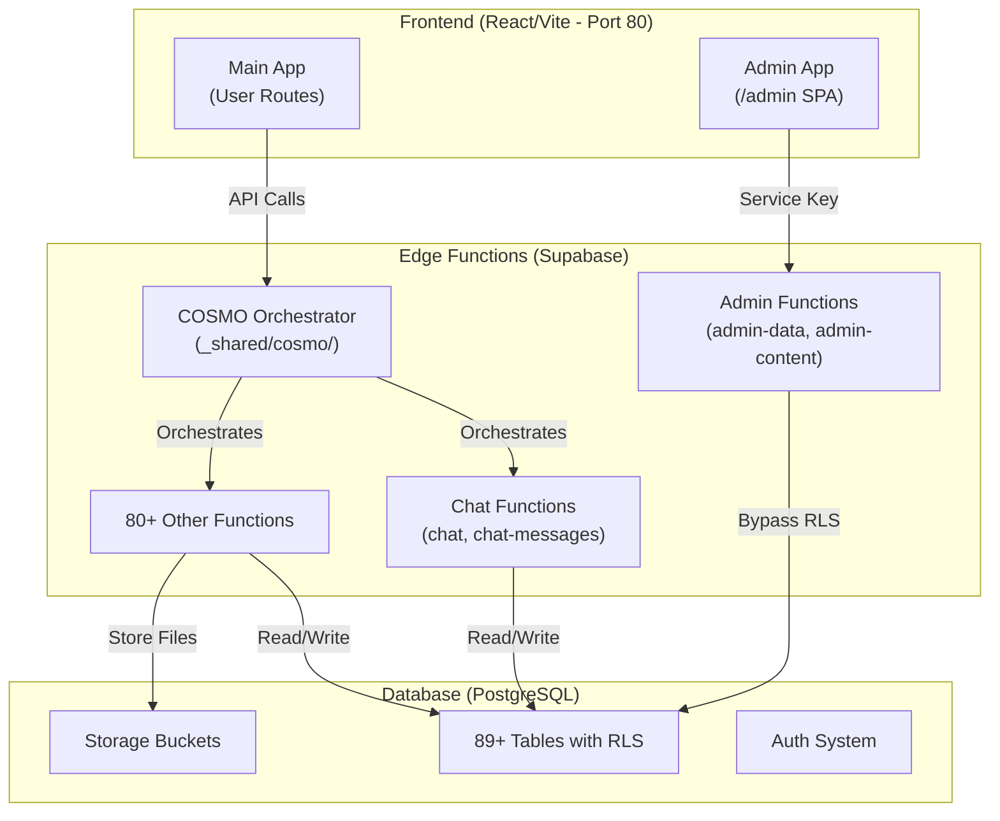
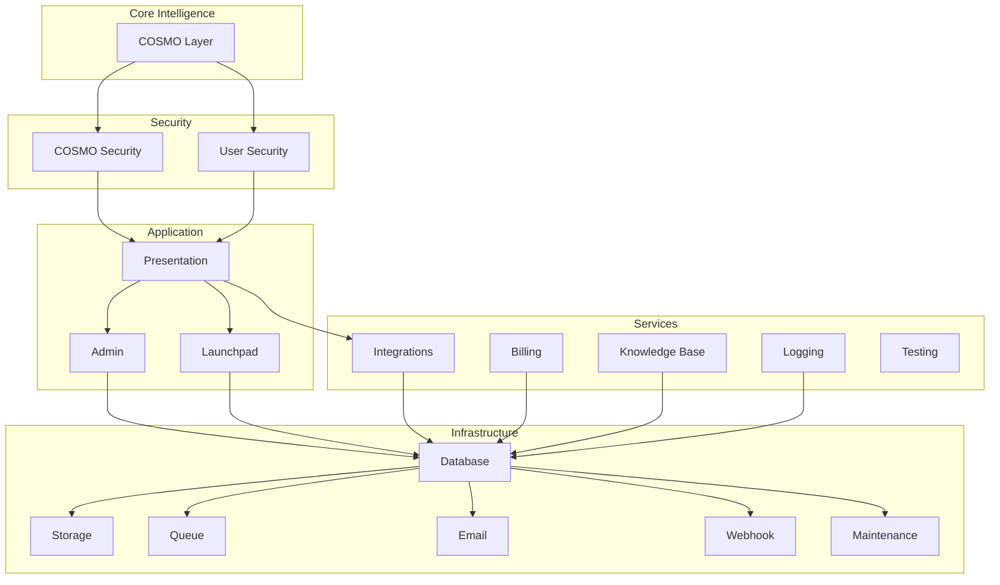
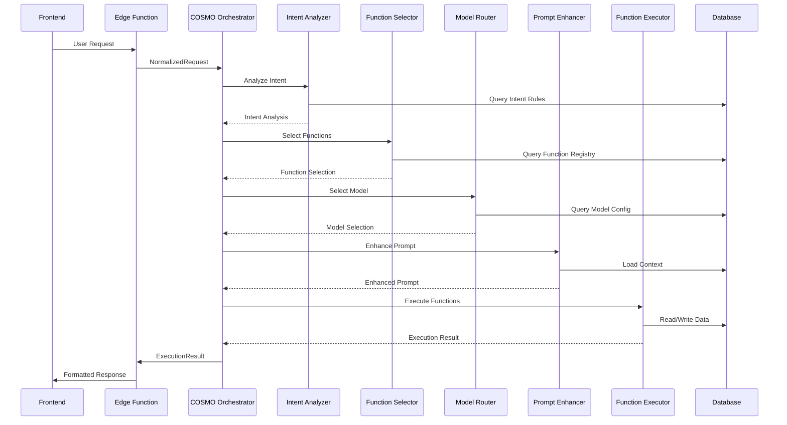

# Spork Ai - Project Overview

> **Quick Reference Guide** - Comprehensive overview of the Spork Ai platform architecture, systems, and development patterns.  
> **Last Updated**: January 2025  
> **Version**: 1.0

---

## Table of Contents

1. [Project Summary](#project-summary)
2. [Technology Stack](#technology-stack)
3. [Architecture Overview](#architecture-overview)
4. [Key Systems](#key-systems)
5. [File Structure](#file-structure)
6. [Database Schema](#database-schema)
7. [Key Patterns & Conventions](#key-patterns--conventions)
8. [Configuration Files](#configuration-files)
9. [Edge Functions](#edge-functions)
10. [Development Workflow](#development-workflow)
11. [Critical Rules & Constraints](#critical-rules--constraints)
12. [Related Documentation](#related-documentation)

---

## Project Summary

### What is Spork Ai?

**Spork Ai** (branded with lowercase "i") is a unified AI platform providing access to **100+ premium AI models** through a single interface. The platform serves both individual users and workspaces, with complete separation between personal and workspace contexts.

### Key Characteristics

- **Type**: Unified AI Platform (SaaS)
- **Architecture**: Function-first, database-driven
- **Key Innovation**: COSMO orchestration layer (Comprehensive Operating System Management Orchestrator)
- **Deployment**: Supabase backend, Vite React frontend
- **Port**: Development server runs on port 80

### Core Value Proposition

- Single interface for 100+ AI models
- Intelligent routing via COSMO orchestration
- Workspace collaboration with complete data isolation
- Database-driven configuration (behavior changes without code deployment)
- Function-first chat system (extensible, actor-agnostic)

---

## Technology Stack

### Frontend

| Category | Technologies |
|----------|-------------|
| **Framework** | React 18.3.1, TypeScript 5.5.3 |
| **Build Tool** | Vite 5.4.1 (dual entry points: main + admin) |
| **Routing** | React Router DOM 6.26.2 |
| **State Management** | TanStack Query 5.56.2 (React Query) |
| **UI Components** | shadcn-ui, Radix UI primitives |
| **Styling** | Tailwind CSS 3.4.11, CSS Variables |
| **Icons** | Lucide React (exclusively - NO EMOJIS) |
| **Code Editor** | CodeMirror, React CodeMirror |
| **Forms** | React Hook Form 7.53.0, Zod 3.23.8 |
| **Charts** | Recharts 2.12.7 |
| **Markdown** | React Markdown 10.1.0 |

### Backend

| Category | Technologies |
|----------|-------------|
| **Platform** | Supabase |
| **Database** | PostgreSQL (89+ tables with RLS) |
| **Auth** | Supabase Auth + Custom System Auth |
| **Storage** | Supabase Storage (buckets: `app-media`, `knowledge-base`) |
| **Functions** | Deno Edge Functions (85+ functions) |
| **Runtime** | Deno (TypeScript-first) |

### Key Libraries

- **Date Handling**: date-fns 3.6.0
- **PDF Generation**: jsPDF 3.0.4, html2canvas 1.4.1
- **File Viewer**: tailwind-pdf-viewer 0.1.5
- **Drag & Drop**: @dnd-kit/core, @dnd-kit/sortable
- **Flow Diagrams**: @xyflow/react 12.4.4
- **Testing**: Vitest 2.1.9, Testing Library, MSW 2.12.4

---

## Architecture Overview

### High-Level Architecture



### Layer Architecture (17 Layers in 5 Domains)

Spork follows a strict layered architecture with **17 distinct layers** organized into **5 domains**:



**Key Rule**: Upper layers may depend on lower layers. Lower layers MUST NOT depend on upper layers.

### Request Flow Through COSMO



---

## Key Systems

### COSMO (Comprehensive Operating System Management Orchestrator)

**Role**: "God Layer" - Orchestrates ALL AI interactions in the platform.

**Location**:
- Backend: `supabase/functions/_shared/cosmo/`
- Frontend: `src/cosmo/`

**Pipeline Stages**:
1. **Request Normalization** → `NormalizedRequest`
2. **Intent Analysis** → Detect user intent and category
3. **Function Selection** → Match and score relevant functions
4. **Model Routing** → Select optimal AI model based on intent/cost
5. **Prompt Enhancement** → Build context-rich prompts
6. **Execution** → Run functions and model calls
7. **Response Processing** → Format and return results

**Key Files**:
- `orchestrator.ts` - Main entry point and pipeline coordinator
- `contracts.ts` - Canonical type definitions (MUST stay in sync)
- `intentAnalyzer.ts` - Intent detection using keyword matching
- `functionSelector.ts` - Function matching and scoring
- `modelRouter.ts` - Model selection with cost/performance weighting
- `promptEnhancer.ts` - Context building (persona, knowledge base, etc.)
- `functionExecutor.ts` - Tool execution engine
- `responseProcessor.ts` - Response formatting and streaming

**Canonical Contracts** (see `src/cosmo/contracts.ts`):
- `NormalizedRequest` - Guaranteed request shape after normalization
- `CosmoContext` - Shared pipeline execution context
- `ExecutionResult` - Unified result before response formatting

> **Critical Rule**: COSMO is the ONLY orchestrator. No parallel systems allowed.

### Authentication System

**Dual Context Architecture** - Complete isolation between app users and admin users:

| Context | Tables | Use Case | Location |
|---------|--------|----------|----------|
| `AuthContext` | `auth.users` + `profiles` | Main application users | `src/contexts/AuthContext.tsx` |
| `SystemAuthContext` | `system_users` + `system_user_sessions` | Admin/Spork Editor users | `src/contexts/SystemAuthContext.tsx` |

**Session Management**:
- **Inactivity Timeout**: 20 minutes (non-negotiable security requirement)
- **Activity Debounce**: 5-second minimum for localStorage writes
- **Activity Listeners**: `click`, `keydown`, `visibilitychange` (never `mousemove`, `scroll`)
- **Cache Clearing**: React Query cache cleared on logout

**Key Pattern - AuthGate**:
```tsx
// AuthGate renders ONLY a minimal loader until auth is verified
const AuthGate = ({ children }) => {
  const { loading, user } = useAuth();
  
  if (loading) {
    return <CenteredLoader />; // NO app UI renders here
  }
  
  if (!user) {
    return <Navigate to="/auth" />;
  }
  
  return children; // Only now does AppLayout render
};
```

### Chat System

**Function-First Architecture**: Extensible, actor-agnostic function execution.

**Key Separation**:
- **Personal Chats**: `chats` table (user_id)
- **Workspace Chats**: `space_chats` table (workspace_id via spaces)

**Key Files**:
- `src/contexts/ChatContext.tsx` - Chat state management
- `src/lib/chatFunctions/` - Function registry and execution
- `supabase/functions/chat/` - Chat API endpoint

**Function Registration**:
Functions are registered in the `chat_functions` table with schemas. COSMO discovers and auto-selects relevant functions based on intent.

### Workspace System

**User/Workspace Independence**: Users and workspaces are completely independent architectural entities.

```
PERSONAL (user_id)              WORKSPACE (workspace_id)
├── profiles                    ├── workspaces
├── chats                       ├── workspace_members
├── prompts                     ├── space_chats (via spaces)
├── personas                    ├── space_prompts
├── user_files                  ├── space_personas
└── credit_purchases            ├── workspace_files
                                └── knowledge_base
```

**Critical Rules**:
- Personal content NEVER leaks into workspace context
- Workspace settings override user settings for context building
- Knowledge Base is workspace-only, not user-level

---

## File Structure

### Frontend Structure

```
src/
├── admin/                      # Admin panel (separate SPA)
│   ├── AdminApp.tsx           # Admin app root component
│   ├── main.tsx               # Admin entry point
│   ├── components/            # Admin-specific components (122 files)
│   ├── pages/                 # Admin pages (23 files)
│   ├── hooks/                 # Admin hooks (15 files)
│   ├── ui/                    # Admin UI components (30 files)
│   └── styles/                # Admin styles (2 CSS files)
│
├── components/                # Shared components
│   ├── ui/                   # shadcn-ui base components (64 files)
│   ├── chat/                 # Chat components (25 files)
│   ├── space/                # Workspace/space components (44 files)
│   ├── admin/                # Admin components for main app (131 files)
│   ├── auth/                 # Authentication components (9 files)
│   ├── files/                # File management (13 files)
│   ├── launchpad/            # Launchpad IDE (7 files)
│   ├── layout/               # Layout components (6 files)
│   └── [feature]/            # Feature-specific components
│
├── contexts/                 # React contexts
│   ├── AuthContext.tsx       # Main app authentication
│   ├── ChatContext.tsx       # Chat state management
│   ├── ChatInputContext.tsx  # Chat input state
│   └── SystemAuthContext.tsx # Admin authentication
│
├── cosmo/                    # COSMO frontend bridge/types
│   ├── contracts.ts          # Canonical types (sync with backend)
│   ├── normalizer.ts         # Request normalization
│   ├── bridge.ts             # Type translation
│   ├── actions/              # Action layer (2 files)
│   ├── adapters/             # Request adapters (4 files)
│   └── types/                # System types (2 files)
│
├── hooks/                    # Custom React hooks (87 files)
│   ├── useAuth.tsx           # Authentication hook
│   ├── useChat.tsx           # Chat operations
│   ├── useSpace.tsx          # Workspace operations
│   ├── useModels.tsx         # AI model management
│   └── [feature].tsx         # Feature-specific hooks
│
├── pages/                    # Route pages (35 files)
│   ├── Dashboard.tsx
│   ├── Chat.tsx
│   ├── Spaces.tsx
│   ├── Settings.tsx
│   ├── Billing.tsx
│   └── admin/                # Admin pages (21 files)
│
├── integrations/             # External integrations
│   └── supabase/
│       ├── client.ts         # Supabase client
│       └── types.ts          # Auto-generated DB types (5400+ lines)
│
├── lib/                      # Utility libraries
│   ├── chatFunctions/        # Chat function system (4 files)
│   └── utils.ts              # Shared utilities
│
├── presentation/             # Presentation layer types
│   └── types/                # Display-only types (7 files)
│
├── types/                    # TypeScript type definitions
│   ├── models.ts             # AI model types
│   ├── sporkProject.ts       # Project types
│   └── [feature].ts          # Feature types
│
├── utils/                    # Utility functions (21 files)
│   ├── logActivity.ts
│   ├── exportAnalytics.ts
│   └── [utility].ts
│
├── assets/                   # Static assets
│   ├── avatars/              # User avatars
│   └── [images]/             # Images and media
│
├── test/                     # Test utilities
│   ├── setup.ts
│   ├── test-utils.tsx
│   └── mocks/                # Mock data
│
├── App.tsx                   # Main app root component
├── main.tsx                  # Main app entry point
└── index.css                 # Global styles
```

### Backend Structure

```
supabase/
├── functions/                # Edge functions (85 functions)
│   ├── _shared/             # Shared code
│   │   ├── cosmo/           # COSMO core (17 files)
│   │   │   ├── orchestrator.ts
│   │   │   ├── contracts.ts
│   │   │   ├── intentAnalyzer.ts
│   │   │   ├── functionSelector.ts
│   │   │   ├── modelRouter.ts
│   │   │   ├── promptEnhancer.ts
│   │   │   ├── functionExecutor.ts
│   │   │   └── [modules].ts
│   │   ├── cosmoRouter.ts
│   │   └── edgeLogger.ts
│   │
│   ├── chat/                # Chat endpoint
│   ├── chat-messages/       # Chat messages endpoint
│   ├── admin-data/          # Admin operations (service key)
│   ├── admin-content/       # Admin content management
│   ├── file-operations/     # File management
│   ├── space-operations/    # Workspace/space management
│   ├── generate-image/      # Image generation
│   ├── query-knowledge-base/# Knowledge base queries
│   ├── send-email/          # Email sending
│   └── [80+ other functions]
│
└── migrations/              # Database migrations (137 migrations)
    ├── 20251125061414_remix_migration_from_pg_dump.sql
    └── [136 more migrations]
```

### Entry Points

| Entry Point | Purpose | Location |
|------------|---------|----------|
| Main App | User-facing application | `index.html` → `src/main.tsx` → `src/App.tsx` |
| Admin App | Admin panel (separate SPA) | `admin/index.html` → `src/admin/main.tsx` → `src/admin/AdminApp.tsx` |

---

## Database Schema

### Table Categories (89+ Tables)

#### Users & Authentication
- `profiles` - User profile information
- `user_roles` - User role assignments
- `system_users` - Admin users (separate from auth.users)
- `system_user_sessions` - Admin user sessions
- `system_user_roles` - Admin role assignments

#### Workspaces
- `workspaces` - Workspace entities
- `workspace_members` - Member assignments with roles
- `spaces` - Workspace spaces/projects
- `space_chats` - Workspace chat sessions
- `space_prompts` - Workspace prompts
- `space_personas` - Workspace personas
- `workspace_files` - Workspace file storage

#### Chat System
- `chats` - Personal chat sessions (user_id)
- `messages` - Chat messages with COSMO metadata
- `chat_functions` - Registered functions for chat
- `chat_actors` - Actor types and permissions
- `chat_containers` - UI container configurations

#### AI & COSMO
- `ai_models` - Available AI models with pricing, capabilities
- `fallback_models` - Fallback model configurations
- `cosmo_intents` - Intent detection keywords and mappings
- `cosmo_function_chains` - Function execution sequences
- `cosmo_debug_logs` - Routing decision logs
- `cosmo_request_queue` - Request queue for batching

#### Content (User & Workspace)
- `prompts` - Personal prompts (user_id)
- `personas` - Personal personas (user_id)
- `user_files` - Personal files (user_id)
- `knowledge_base` - Document storage (workspace-level only)

#### Billing & Usage
- `subscription_tiers` - Plan definitions
- `user_subscriptions` - User subscriptions
- `usage_tracking` - Usage counters
- `usage_logs` - Detailed usage events
- `credit_purchases` - One-time credit purchases
- `payment_processors` - Payment provider configs

#### Email Infrastructure
- `email_providers` - Provider configurations
- `email_templates` - Email templates
- `email_rules` - Automation rules
- `email_logs` - Send history

#### System & Configuration
- `system_settings` - Global configuration (database-driven)
- `activity_log` - Activity tracking
- `admin_documentation` - Admin documentation content

### Key Database Principles

1. **RLS Enabled**: All tables have Row Level Security enabled
2. **User/Workspace Independence**: Personal content never leaks into workspace context
3. **Database-Driven Configuration**: Behavior configured via tables, not hardcoded
4. **Template Pattern**: All templates follow consistent structure (id, name, description, category_id, icon, image_url, display_mode, is_active, is_featured)

### Configuration Tables Pattern

```typescript
// system_settings table structure
{
  setting_key: string,      // e.g., 'default_model', 'cosmo_routing_config'
  setting_value: JSONB,     // Flexible configuration object
  setting_type: string,     // 'ai', 'billing', 'email', etc.
  updated_at: timestamp
}
```

---

## Key Patterns & Conventions

### Development Patterns

#### Top-Down Development (MANDATORY)
Before implementing ANY feature:
1. **Full Impact Analysis** - Understand how changes affect all components
2. **Plan Complete Implementation** - Database schema, RLS, edge functions, UI, hooks, types
3. **Verify Data Flow** - End-to-end from UI through database and back
4. **Avoid Surface-Level Patches** - Address root causes, not symptoms

#### Standard Hook Pattern

```typescript
export function useFeature(id?: string) {
  const { user } = useAuth();
  const queryClient = useQueryClient();
  
  // Query with proper dependencies
  const query = useQuery({
    queryKey: ['feature', id],
    queryFn: async () => {
      const { data, error } = await supabase
        .from('table')
        .select('*')
        .eq('id', id);
      if (error) throw error;
      return data;
    },
    enabled: !!id && !!user,
    staleTime: 5 * 60 * 1000,  // 5 minutes
    gcTime: 30 * 60 * 1000,    // 30 minutes
  });
  
  // Mutation with invalidation
  const mutation = useMutation({
    mutationFn: async (data) => {
      const { error } = await supabase
        .from('table')
        .insert(data);
      if (error) throw error;
    },
    onSuccess: () => {
      queryClient.invalidateQueries({ queryKey: ['feature'] });
      toast.success('Created successfully');
    },
    onError: (error) => {
      toast.error(error.message);
    },
  });
  
  return { ...query, mutation };
}
```

#### Edge Function Pattern

```typescript
import { serve } from "https://deno.land/std@0.168.0/http/server.ts";
import { createClient } from "https://esm.sh/@supabase/supabase-js@2";

const corsHeaders = {
  'Access-Control-Allow-Origin': '*',
  'Access-Control-Allow-Headers': 'authorization, x-client-info, apikey, content-type',
};

serve(async (req) => {
  // 1. CORS preflight
  if (req.method === 'OPTIONS') {
    return new Response(null, { headers: corsHeaders });
  }

  try {
    // 2. Create Supabase client
    const supabase = createClient(
      Deno.env.get('SUPABASE_URL')!,
      Deno.env.get('SUPABASE_ANON_KEY')!,
      { global: { headers: { Authorization: req.headers.get('Authorization')! } } }
    );

    // 3. Validate auth (if required)
    const { data: { user }, error: authError } = await supabase.auth.getUser();
    if (authError || !user) {
      return new Response(
        JSON.stringify({ error: 'Unauthorized' }),
        { status: 401, headers: { ...corsHeaders, 'Content-Type': 'application/json' } }
      );
    }

    // 4. Business logic
    const result = await performOperation(supabase, user);

    // 5. Return success
    return new Response(
      JSON.stringify(result),
      { headers: { ...corsHeaders, 'Content-Type': 'application/json' } }
    );

  } catch (error) {
    // 6. Structured error response
    console.error('Error:', error);
    return new Response(
      JSON.stringify({
        error: error.message,
        code: error.code || 'UNKNOWN',
        details: error.details || null,
        hint: error.hint || null,
      }),
      { status: error.status || 500, headers: { ...corsHeaders, 'Content-Type': 'application/json' } }
    );
  }
});
```

### Naming Conventions

| Type | Pattern | Example |
|------|---------|---------|
| **Brand Name** | Always "Ai" with lowercase "i" | Spork Ai (never "AI") |
| **Icons** | Lucide icons exclusively | NO EMOJIS EVER |
| **COSMO Module** | `camelCase.ts` | `modelRouter.ts`, `intentAnalyzer.ts` |
| **Edge Function** | `kebab-case/` | `check-quota/`, `chat/` |
| **Page** | `PascalCase.tsx` | `Dashboard.tsx` |
| **Component** | `PascalCase.tsx` | `ChatInput.tsx` |
| **Hook** | `useCamelCase.tsx` | `useChat.tsx` |
| **Migration** | `YYYYMMDDHHMMSS_description.sql` | `20240115120000_add_personas.sql` |

### Container Margins

Standard container pattern:
```tsx
<div className="container mx-auto max-w-7xl px-6">
  {/* Content */}
</div>
```

### Color Usage

All colors must use CSS variables from design system:
```css
/* DO */
bg-background text-foreground
bg-primary text-primary-foreground
bg-muted text-muted-foreground

/* DON'T */
bg-white text-black
bg-[#464646]
```

---

## Configuration Files

### Build & Development

| File | Purpose |
|------|---------|
| `vite.config.ts` | Vite configuration with dual entry points, port 80, admin SPA routing |
| `package.json` | Dependencies and npm scripts |
| `tsconfig.json` | TypeScript configuration (strict mode) |
| `tsconfig.app.json` | App-specific TypeScript config |
| `tailwind.config.ts` | Tailwind CSS configuration |
| `postcss.config.js` | PostCSS configuration |
| `eslint.config.js` | ESLint configuration |

### Environment Variables

Supabase configuration (see `src/integrations/supabase/client.ts`):
- `VITE_SUPABASE_URL` - Supabase project URL
- `VITE_SUPABASE_PUBLISHABLE_KEY` - Supabase anon key

### Entry Points

| Entry Point | HTML File | React Root | Component |
|------------|-----------|------------|-----------|
| Main App | `index.html` | `src/main.tsx` | `src/App.tsx` |
| Admin App | `admin/index.html` | `src/admin/main.tsx` | `src/admin/AdminApp.tsx` |

---

## Edge Functions

### Core Functions

| Function | Purpose | Location |
|----------|---------|----------|
| `chat` | Main chat endpoint (routes through COSMO) | `supabase/functions/chat/` |
| `cosmo-*` | COSMO orchestration functions | `supabase/functions/cosmo-*/` |
| `admin-data` | Admin operations (bypasses RLS with service key) | `supabase/functions/admin-data/` |
| `admin-content` | Admin content management | `supabase/functions/admin-content/` |
| `file-operations` | File management (upload, download, delete) | `supabase/functions/file-operations/` |
| `space-operations` | Workspace/space management | `supabase/functions/space-operations/` |
| `generate-image` | AI image generation | `supabase/functions/generate-image/` |
| `query-knowledge-base` | Knowledge base document queries | `supabase/functions/query-knowledge-base/` |
| `send-email` | Email sending via configured providers | `supabase/functions/send-email/` |
| `billing-webhooks` | Payment processing webhooks | `supabase/functions/billing-webhooks/` |
| `check-quota` | Usage quota validation | `supabase/functions/check-quota/` |

### Function Organization

- **COSMO Core**: `supabase/functions/_shared/cosmo/` (shared across functions)
- **Feature Functions**: Individual directories in `supabase/functions/`
- **Admin Functions**: Use service role key to bypass RLS

### Function Pattern (COSMO Integration)

```typescript
// Edge functions become thin wrappers
import { handleChatRequest, corsHeaders } from '../_shared/cosmo/index.ts';

serve(async (req) => {
  if (req.method === 'OPTIONS') {
    return new Response(null, { headers: corsHeaders });
  }
  
  return handleChatRequest(req);
});
```

---

## Development Workflow

### Starting Development

1. **Install Dependencies**:
   ```bash
   npm install
   ```

2. **Start Dev Server**:
   ```bash
   npm run dev
   ```
   - Runs on `http://localhost` (port 80)
   - Requires administrator privileges on Windows for port 80

3. **Access Applications**:
   - Main App: `http://localhost`
   - Admin Panel: `http://localhost/admin`

### Key Scripts

| Script | Purpose |
|--------|---------|
| `npm run dev` | Start Vite dev server (port 80) |
| `npm run build` | Production build |
| `npm run build:dev` | Development build |
| `npm run lint` | Run ESLint |
| `npm run preview` | Preview production build |

### Testing

- **Framework**: Vitest 2.1.9
- **Test Setup**: `src/test/setup.ts`
- **Test Utilities**: `src/test/test-utils.tsx`
- **Mock Service Worker**: MSW for API mocking
- **Coverage**: v8 provider configured

### Code Organization Rules

1. **Database Changes**: Always via migrations in `supabase/migrations/`
2. **Server Logic**: Edge functions in `supabase/functions/`
3. **UI Components**: Shared components in `src/components/`
4. **Data Fetching**: Custom hooks in `src/hooks/`
5. **Types**: Canonical types in `src/cosmo/contracts.ts` (COSMO), presentation types in `src/presentation/types/`

---

## Critical Rules & Constraints

### Security

1. **RLS Policies**: Required on all tables - design before writing code
2. **Admin Operations**: Always use `admin-data` edge function with service role key
3. **Never Raw SQL**: Edge functions must use Supabase client methods only
4. **Inactivity Timeout**: 20 minutes, non-negotiable
5. **Session Management**: Clear React Query cache on logout

### Architecture

1. **COSMO is the ONLY orchestrator** - No parallel systems allowed
2. **User and workspace data MUST be separated** - Personal content never leaks into workspace context
3. **Database-driven configuration** - No hardcoded behavior, all config in tables
4. **All requests go through COSMO normalization** - No direct model calls bypassing COSMO
5. **Contract Synchronization** - `src/cosmo/contracts.ts` must stay in sync with `supabase/functions/_shared/cosmo/contracts.ts`

### Performance

1. **Activity Debounce**: 5-second minimum for localStorage writes
2. **React Query Caching**: `staleTime: 5min`, `gcTime: 30min` for admin data
3. **Query Limits**: Supabase default is 1000 rows - check before assuming bugs
4. **Clear Cache on Logout**: `queryClient.clear()`

### Error Handling

All errors must be structured:
```typescript
{
  message: string,      // Human-readable
  code: string,         // PostgreSQL or custom code
  httpStatus: number,   // HTTP status
  details: string,      // Technical details
  hint: string          // Actionable suggestion
}
```

### TypeScript

1. **Strict Mode**: Non-negotiable in production
2. **Result Pattern**: Use `Result<T>` for error handling over exceptions where applicable
3. **Types Location**: Keep close to usage or in dedicated `types/` folder

### UI/UX Rules

1. **Brand Name**: Always "Ai" with lowercase "i" (never "AI")
2. **Icons**: Lucide icons exclusively (NO EMOJIS EVER)
3. **Container Margins**: `container mx-auto max-w-7xl px-6`
4. **Featured Items**: Yellow color indicator (`text-yellow-500`)

---

## Related Documentation

### Detailed Documentation Files

| Document | Purpose | Location |
|----------|---------|----------|
| **ARCHITECTURE.md** | Complete architecture guide with patterns | `docs/ARCHITECTURE.md` |
| **COSMO.md** | COSMO orchestration system details | `docs/COSMO.md` |
| **AI-DEVELOPMENT.md** | Engineering definitions of Tools, Assistants, Agents | `docs/AI-DEVELOPMENT.md` |
| **CHAT-FUNCTIONS.md** | Function-first chat architecture | `docs/CHAT-FUNCTIONS.md` |
| **TERMINOLOGY-CHEATSHEET.md** | Quick terminology reference | `docs/TERMINOLOGY-CHEATSHEET.md` |
| **TESTING.md** | Testing patterns and CI/CD | `docs/TESTING.md` |
| **RELEASE-CHECKLIST.md** | Production release checklist | `docs/RELEASE-CHECKLIST.md` |
| **SECURITY-VERIFICATION.md** | Security verification guidelines | `docs/SECURITY-VERIFICATION.md` |

### Governance Documents

| Document | Purpose | Location |
|----------|---------|----------|
| **COSMO Constitution** | COSMO layer authority and rules | `docs/governance/01-COSMO-CONSTITUTION.md` |
| **System Laws** | Core system rules | `docs/governance/02-SYSTEM-LAWS.md` |
| **Layer Architecture** | 17-layer architecture specification | `docs/governance/07-LAYER-ARCHITECTURE.md` |
| **Terminology Guide** | Complete terminology reference | `docs/governance/08-TERMINOLOGY-GUIDE.md` |
| **Style System Authority** | Design system rules | `docs/governance/09-STYLE-SYSTEM-AUTHORITY.md` |

### Development Guides

| Document | Purpose | Location |
|----------|---------|----------|
| **lovable-ai-methodology.md** | Core development principles | `docs/lovable-ai-methodology.md` |
| **ai-prompt-library.md** | Prompt templates and guidance | `docs/ai-prompt-library.md` |
| **Implementation Guides** | Implementation patterns | `docs/governance/03-IMPLEMENTATION-GUIDES.md` |

---

## Quick Reference

### Where to Find Things

| What You Need | Where It Goes / Is Located |
|---------------|---------------------------|
| New page | `src/pages/` |
| Reusable UI component | `src/components/` |
| Data fetching logic | `src/hooks/` |
| Server logic | `supabase/functions/` |
| COSMO logic | `supabase/functions/_shared/cosmo/` |
| DB schema change | `supabase/migrations/` |
| UI types | `src/presentation/types/` |
| COSMO types | `src/cosmo/contracts.ts` |
| Admin pages | `src/pages/admin/` or `src/admin/pages/` |
| Admin components | `src/components/admin/` or `src/admin/components/` |

### Common Tasks

| Task | Steps |
|------|-------|
| Add new feature | 1. Database migration, 2. RLS policies, 3. Edge function, 4. Hook, 5. Component, 6. Page/Route |
| Add admin feature | 1. `admin-data` function update, 2. Admin hook, 3. Admin component, 4. Admin page |
| Add AI capability | 1. Register in `chat_functions`, 2. COSMO routing config, 3. Edge function, 4. UI integration |
| Add workspace feature | 1. Workspace table (if needed), 2. RLS with workspace_id, 3. Workspace hooks, 4. Space components |

---

**This document serves as the primary reference for understanding the Spork Ai platform architecture, structure, and development patterns. For detailed implementation guidance, refer to the specific documentation files listed in the Related Documentation section.**


